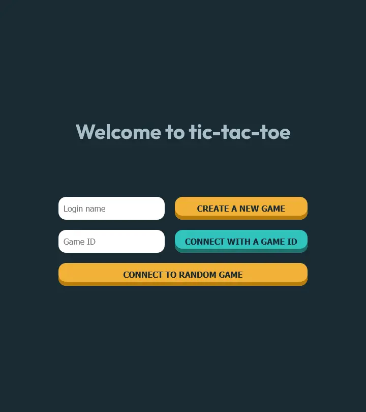
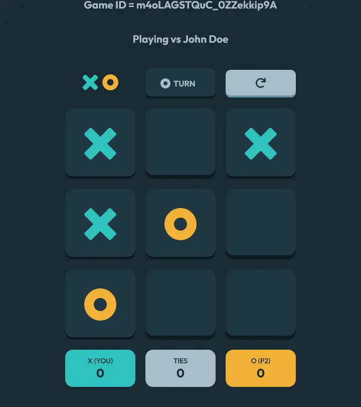

# Tic-Tac-Toe Java Multiplayer Game

This project is an implementation of the tic-tac-toe game. Built with Spring Boot and Websocket API.

<div style="display: flex; justify-content: space-between; height: 450px; width: 100%;">
  
  
</div>


## Features

- Real time notifications
- Connect to a random game
- Connect to specific games by providing a game ID
- Keep track of the session score


## Installation

### Pre-requisites

[Java Development Kit (JDK)](https://www.oracle.com/java/technologies/downloads/) is required to run this project

## Run this project locally

1. Clone this repository to your local machine:

```bash
 git clone https://github.com/Matheus-OAMK/TicTacToe_Java.git
```

2. Inside the root directory run the game with the following command:

```bash
 ./mvnw spring-boot:run
```

3. Open a modern browser and visit [localhost/8080](http://localhost:8080/) on two seperate tabs

4. On the first tab enter a name and create a game

5. On the second tab you can click "connect to a random game" or copy and paste the game ID from the first tab


## Technologies

- Java with Spring Boot
- WebSocket using stomp-client
- Restful API
